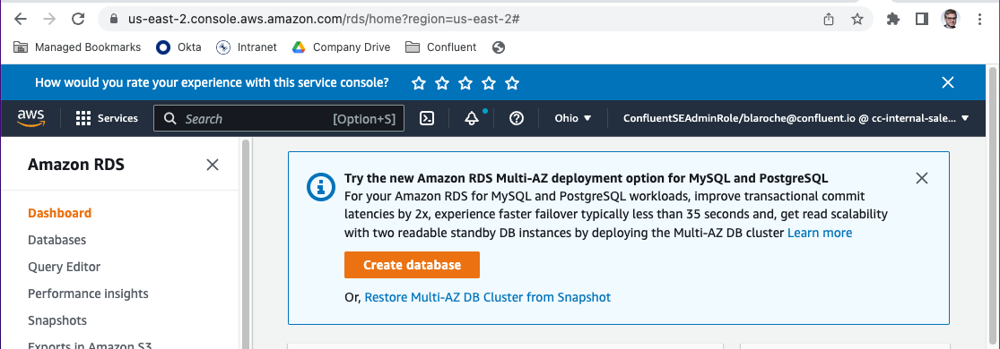
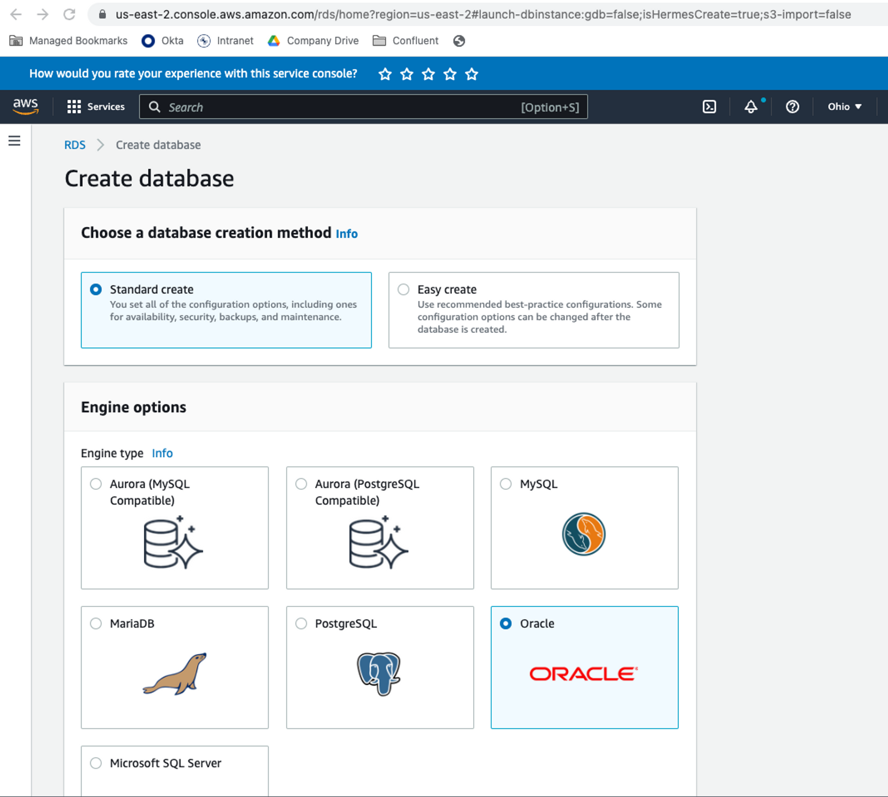

# Oracle-Confluent-MongoDB
Migrate Oracle data to MongoDB with Confluent Cloud

The following __"Hands-on Lab"__ will allow you to migrate Oracle data to MongoDB with the use of the Confluent Cloud.  Depending on your familiarity with MongoDB and The Confluent Cloud and the AWS management console, the lab can be anywhere from 60 to 90 minutes in total. 

We begin by creating an AWS RDS instance of Oracle.  Log into your AWS Console and navigate to "RDS"

  


Pick a Region... any region, but pick the same region for Oracle, Confluent Cloud, and MongoDB Atlas. Seriously same cloud provider and same region for all 3 services.  Why? Well there is this thing called egress traffic and it has a cost associated with it. If you deploy in production across multiple regions its just a matter of time before your manager schedules a rather unpleasant meeting with you. Also if you deploy across regions or cloud providers there is a whole networking discussion that is outside the scope of this hands-on lab.  Suffice it to say if you don't listen to me now, you will find out later. (I told you)


  


We begin by using the sample "Customer Orders" schema provided by Oracle Developer Advocate Chris Saxon
|Description                            | Link                                                  | 
|-----------------------------------------------|-----------------------------------------------|
| Orginal Blog| [https://blogs.oracle.com/sql/post/announcing-a-new-sample-schema-customer-orders](https://blogs.oracle.com/sql/post/announcing-a-new-sample-schema-customer-orders)|
|Updated Blog|[https://blogs.oracle.com/sql/post/announcing-updates-to-the-customer-orders-sample-schema](https://blogs.oracle.com/sql/post/announcing-updates-to-the-customer-orders-sample-schema)|
|Main Github|[https://github.com/oracle-samples/db-sample-schemas](https://github.com/oracle-samples/db-sample-schemas)|
|Customer Orders SQL|[https://github.com/oracle-samples/db-sample-schemas/tree/main/customer_orders](https://github.com/oracle-samples/db-sample-schemas/tree/main/customer_orders)|

I recommend getting Oracle sql developer from this site, its a handy tool and a great visual interface compared to command line.  Your demo will be much better with it.

[Oracle SQL Developer Download](https://www.oracle.com/database/sqldeveloper/technologies/download/)

Follow the intsructions in his blog to install the tables via command line...  Or cut and paste the specific table DDL and data into SQL Navigator.

Next we create a view that includes store_id and store_name.

```sql
CREATE OR REPLACE FORCE EDITIONABLE VIEW "CUSTOMER_ORDER_PRODUCTS_BY_STORE" (
    "ORDER_ID", 
    "CUSTOMER_ID", 
    "EMAIL_ADDRESS", 
    "FULL_NAME", 
    "STORE_ID", 
    "STORE_NAME", 
    "ITEMS",
    "ORDER_DATETIME", 
    "ORDER_STATUS", "ORDER_TOTAL") AS 
select c.order_id, 
    c.customer_id, 
    c.email_address, 
    c.full_name, 
    s.store_id, 
    s.store_name, 
    c.items, 
    c.order_datetime, 
    c.order_status, 
    c.order_total 
from customer_order_products c,
    stores s,
    orders o
where c.order_id = o.order_id
and o.store_id = s.store_id
```

Notice that this view selects from the customer_order_products view. If you really really care about performance in production you might consider creating materialized views.  For this example it all works just fine as is for me. My rule of thumb as a developer is get it done quickly and iterate, let the DBA schedule an unpleasant meeting with me later. Developers with this philosophy insure the need for your company to hire a good DBA.


