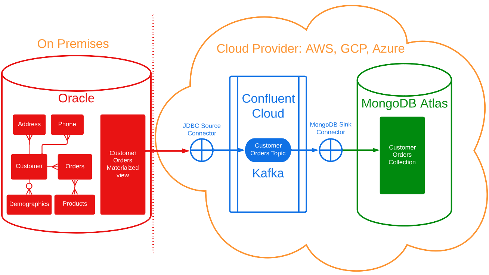
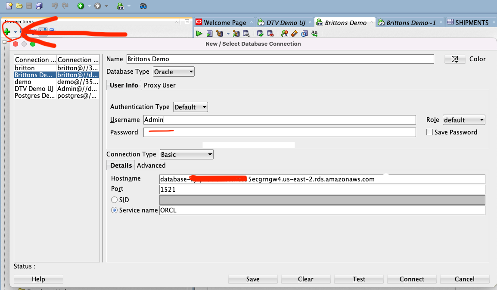
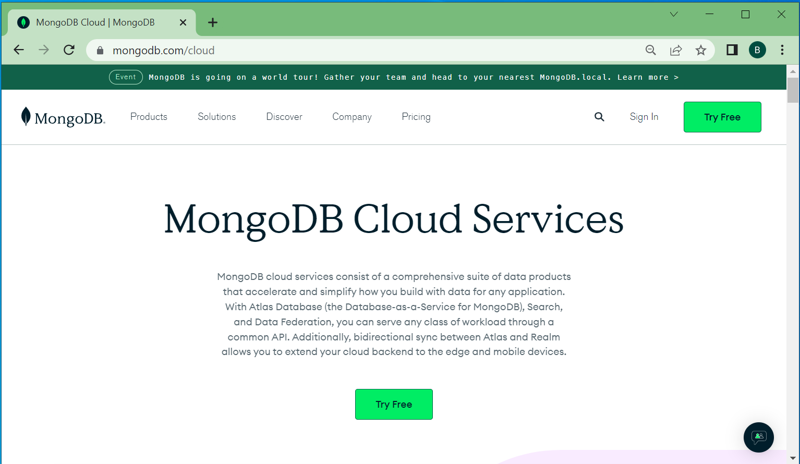
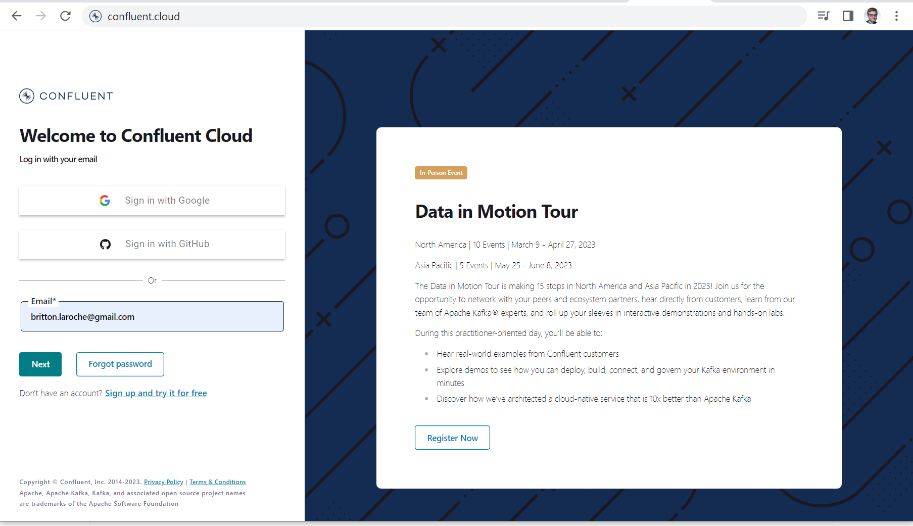

# Oracle-Confluent-MongoDB
Migrate Oracle data to MongoDB with Confluent Cloud

This is a powerful hands on lab that will show you how to migrate workloads off of Oracle into MongoDB.  This lab start by migrating live customer orders to MongoDB so that the reads can be offloaded to a modern cloud based database.  A good overview of the power of Confluent Cloud working with MongoDB Atlas is here:    

[Effective Digital Transformation with the New "Kafcongo" Tech Stack: Kafka, Confluent & MongoDB](https://www.linkedin.com/pulse/effective-digital-transformation-new-kafcongo-tech-stack-laroche/)

The following __"Hands-on Lab"__ will allow you to migrate Oracle data to MongoDB with the use of the Confluent Cloud.  Depending on your familiarity with MongoDB and The Confluent Cloud and the AWS management console, the lab can be anywhere from 60 to 90 minutes in total. Assuming you have an existing Oracle development databse accessible to the cloud you can skip the first step and use your own database. In some instructor lead lab environments a prepopulated Oracle environment may have been configured for you and save about 45 minutes.  This negates the need to install SQL Developer or any Oracle command line tools.  All other aspects of the lab use a modern cloud based toolset.

If you don't have access to an Oracle instance, no worries we will show you how to create one in the AWS cloud. This particluar hands-on lab is specific to Oracle but the same concepts apply to any JDBC compliant database (Postgres, Sql Server, MySQL etc...). The [Confluent Hub](https://www.confluent.io/hub/) has CDC connectors for many different databases as well, covering all the major databases.

 

The sections below have videos that show how to set up the various environments and really speed up the process of getting started. If you are being lead by an instructor you will watch the instructor set up the environments instead of watching the videos.

# Create an Oracle Database 

We begin by creating an AWS RDS instance of Oracle.  Log into your AWS Console and navigate to "RDS".  
[https://console.aws.amazon.com](https://console.aws.amazon.com)

If you want the free tier and least cost for all three servcies in AWS (Oracle RDS, MongoDB Atlas, Confluent Cloud) then I suggest Oregon AWS US West 2. Pick the same region for Oracle, Confluent Cloud, and MongoDB Atlas. If you deploy across regions or cloud providers there is a whole networking discussion that is outside the scope of this hands-on lab.  

**Pick the same region for Oracle, Confluent Cloud, and MongoDB Atlas: AWS Oregon US West 2**  

| Must Watch! Hands on Video: Setting up Oracle |
|----------------|
|[Click here to watch a 5 Minute Video on how to create an Oracle instance in AWS](https://youtu.be/FTIlO-GZ9uo)|   
|<a href="https://youtu.be/FTIlO-GZ9uo" target="video"><br></a>|  

[Hands on example video to install an Oracle instance](https://youtu.be/FTIlO-GZ9uo)


If you did not watch the video, be sure to modify the Security group rules and add a 0.0.0.0/0 route for inbound as well as outbound traffic.  Networking is outside the scope of this simple tutorial. Never do this with an offical environment, but its fine for this demo.  You can go back later and remove these wide open ranges when you get the IP information for Confluent Cloud, but for now this works.

| Must Watch! Hands on Video: Installing SQL Developer and the sample Customer Orders data |
|----------------|
|[Click here to watch a 12 Minute Video on how to load the Oracle Databse with customer orders](https://youtu.be/D1lOtF0HqGk)|   
|<a href="https://youtu.be/D1lOtF0HqGk" target="video"><br></a>|  

## Create the Customer Orders Schema and Populate it With Data

We begin by using the sample "Customer Orders" schema provided by Oracle Developer Advocate Chris Saxon
|Description                            | Link                                                  | 
|-----------------------------------------------|-----------------------------------------------|
| Orginal Blog| [https://blogs.oracle.com/sql/post/announcing-a-new-sample-schema-customer-orders](https://blogs.oracle.com/sql/post/announcing-a-new-sample-schema-customer-orders)|
|Main Github|[https://github.com/oracle-samples/db-sample-schemas](https://github.com/oracle-samples/db-sample-schemas)|
|Customer Orders SQL|[https://github.com/oracle-samples/db-sample-schemas/tree/main/customer_orders](https://github.com/oracle-samples/db-sample-schemas/tree/main/customer_orders)|

I recommend getting Oracle sql developer from this site, its a handy tool and a great visual interface compared to command line.  Your demo will be much better with it.

[Oracle SQL Developer Download](https://www.oracle.com/database/sqldeveloper/technologies/download/)

After you install SQL Navigator click the drop list next to the little green plus sign in the upper left of the gui and select create new connection. Use SQL Navigator to connect to your database using the credentials you specified when you created the database, Admin user and password.  The host name is provided to you in the AWS Console. The Service name is ORCL.

  

Follow the intsructions in his blog to install the tables via command line...  Or cut and paste the specific table DDL and data into SQL Navigator.

|Create the tables|
|-----------------|
|[co_tables.sql](https://github.com/oracle-samples/db-sample-schemas/blob/main/customer_orders/co_tables.sql)|

Open the sql file and cut and paste the contents into SQL Developer. Be sure to hit the arrow with a list in the top middle tool bar to execute all the statements... just copy the insert and create statements only you don't need the begin and end blocks.

  

|create the views|
|-----------------|
|[co_views.sql](https://github.com/oracle-samples/db-sample-schemas/blob/main/customer_orders/co_views.sql)|

|Load data from the SQL files into the tables in this order| Notes |
|------------------------------------|------------------------------------|
|[customers.sql](https://github.com/oracle-samples/db-sample-schemas/blob/main/customer_orders/customers.sql)| |
|[products.sql](https://github.com/oracle-samples/db-sample-schemas/blob/main/customer_orders/products.sql)||
|[stores.sql](https://github.com/oracle-samples/db-sample-schemas/blob/main/customer_orders/stores.sql)||
|[orders.sql](https://github.com/oracle-samples/db-sample-schemas/blob/main/customer_orders/orders.sql)|Click in the text block select all, copy and paste in SQL Developer|
|[order_items.sql](https://github.com/oracle-samples/db-sample-schemas/blob/main/customer_orders/order_items.sql)|Click in the text block select all, copy and paste in SQL Developer|


Oh and by the way... DO NOT FORGET TO COMMIT your work! Commit like its 1979! If you don't you may lose all your work inserting data.   


 


Next we create a view that includes store_id and store_name.

```sql
CREATE OR REPLACE VIEW "CUSTOMER_ORDER_PRODUCTS_BY_STORE" (
    "ORDER_ID", 
    "CUSTOMER_ID", 
    "EMAIL_ADDRESS", 
    "FULL_NAME", 
    "STORE_ID", 
    "STORE_NAME", 
    "ITEMS",
    "ORDER_DATETIME", 
    "ORDER_STATUS", 
    "ORDER_TOTAL") AS 
select c.order_id, 
    c.customer_id, 
    c.email_address, 
    c.full_name, 
    s.store_id, 
    s.store_name, 
    c.items, 
    c.order_datetime, 
    c.order_status, 
    c.order_total 
from customer_order_products c,
    stores s,
    orders o
where c.order_id = o.order_id
and o.store_id = s.store_id
```

Notice that this view selects from the customer_order_products view. If you really really care about performance in production you might consider creating materialized views.  For this example it all works just fine as is for me. My rule of thumb as a developer is get it done quickly and iterate, let the DBA schedule an unpleasant meeting with me later. Developers with this philosophy insure the need for your company to hire a really good Oracle DBA. But then again these days most developers don't write SQL.

Also note there is a hidden "gotcha" when using views that we will show in a future section.

Congratulations we are all done setting up our Oracle environment!  You can confirm the succesful install by running the following sql in SQL Developer:

```sql
select * from CUSTOMER_ORDER_PRODUCTS_BY_STORE
```

If you dont see data check each one of your tables to see if they have data.  Most likely you skipped a step.  The hardest part of the lab and most of the work is now behind us!


# Create a MongoDB Atlas M0 Cluster

Now we create a new MongoDB Atlas instance.  The process begins by clicking on the folllowing url.  
[https://cloud.mongodb.com](https://cloud.mongodb.com) or [https://mongodb.com/cloud](https://mongodb.com/cloud)



Press the "Try Free" button and enter your information, or sign in with google.  Create an M0 cluster in AWS US West2 Oregon.  Set up an admin user and a demo user with read and write to any database privileges.


| Must Watch! Hands on Video: Creating a MongoDB Atlas Cluster |
|----------------|
|[Click here to watch a 6 Minute Video on how to create an Atlas Cluster in AWS](https://youtu.be/J61_hiFauNs)|   
|<a href="https://youtu.be/J61_hiFauNs" target="video"><br></a>| 

Congratulations you have your first cluster up and running in just a few minutes.  The next step is to load data from Oracle through the Confluent Cloud.  Lets create a Confluent Cloud Cluster.

# Create a Confluent Cloud Cluster

Click on the link below to set up your free basic cluster in the confluent cloud.   
[https://confluent.cloud](https://confluent.cloud)



Create a basic cluster in AWS Oregon US West 2. We don't need to work with networking as the basic cluster is only available with public end points. Dedicated clusters allow private networking.


| Must Watch! Hands on Video: Creating a basic Confluent Cloud cluster |
|----------------|
|[Click here to watch a 4 Minute Video on how to create a Confluent Cloud basic cluster in AWS](https://youtu.be/q437AGwdYoY)|   
|<a href="https://youtu.be/q437AGwdYoY" target="video"><br></a>| 

Now that the Confluent Cloud basic cluster is created we are ready to begin configuring the Oracle source connector.


# Create a JDBC Source Connector For Oracle

Open up the Confluent Cloud console [https://confluent.cloud](https://confluent.cloud) and the AWS RDS Oracle instance we created earlier [https://console.aws.amazon.com](https://console.aws.amazon.com)

| Must Watch! Hands on Video: Creating a Fully Managed Oracle JDBC Connector in the Confluent Cloud  |
|----------------|
|[Click here to watch an 11 Minute Video on how to create a fully managed Oracle source connector](https://www.youtube.com/watch?v=K00cZU2khpo)|   
|<a href="https://www.youtube.com/watch?v=K00cZU2khpo" target="video"><br></a>| 

# Create a MongoDB Sink Connector
Start by opening the Confluent Cloud and mongoDB Atlas clusters in the browser:   

[https://confluent.cloud](https://confluent.cloud) and [https://cloud.mongodb.com](https://cloud.mongodb.com)

Lets start by opening the [Confluent Cloud](https://confluent.cloud) console window.  Navigate to "Enviroments" and select the "default" environment where we created our basic cluster. Click on the basic cluster we just created and select "Connectors" on the left hand side menu.   

In the connectors console we will see a list of connectors (if we have any) and a button in the upper right that says "Add a Connector."  Click the add a connector button and search for MongoDB.  Lets select the fully managed "MongoDB Sink Connector" and we will begin configuration.
    
| Must Watch! Hands on Video: Creating a Fully Managed MongoDB Atlas Sink Connector in the Confluent Cloud  |
|----------------|
|[Click here to watch a 6 Minute Video on how to create a Confluent Cloud basic cluster in AWS](https://www.youtube.com/watch?v=_9cvz7kmeCg)|   
|<a href="https://www.youtube.com/watch?v=_9cvz7kmeCg" target="video"><br></a>| 


# Migrate live orders in real-time from Oracle to MongoDB Atlas

Now we will generate some live test orders in Oracle and watch them flow in near real time through the connector into Confluent Cloud customer orders topic.  From there we will watch them load into the MongoDB CustomerOrders collection. We begin by opening SQL Developer and creating an order sequence.  Next we compile an Oracle PL/SQL procedure to generate random customer orders in Oracle.   

The create new order procedure takes one argument which is the number of orders to create.  If no value is specified it will generate 1 order by default. 

| Must Watch! Hands on Video: Migrating Live Customer Order Data from Oracle to MongoDB Atlas with the Confluent Cloud  |
|----------------|
|[Click here to watch a 9 Minute Video on how to migrate live orders from Oracle to MongoDB](https://www.youtube.com/watch?v=Z3aK3IqaEWY)|   
|<a href="https://www.youtube.com/watch?v=Z3aK3IqaEWY" target="video"><br></a>| 


## Create Test Orders

```sql
create sequence order_seq start with 10000 INCREMENT by 1;
```

```sql
CREATE OR REPLACE PROCEDURE CREATE_NEW_ORDER 
(
  NBRORDS IN NUMBER DEFAULT 1 
) AS 
  vnbr_cust_id number(38,0) := 1;
  vnbr_store_id number(38,0) := 1;
  vnbr_product_id number(38,0) := 1;
  vnbr_order_id number(38,0) := 1;
  vnbr_price number(10,2) := 19.99;
  vnbr_count number(38,0) := 0;
  vnbr_failed number(38,0) := 0;
  
  l_seed VARCHAR2(100);
  
BEGIN
  l_seed := TO_CHAR(SYSTIMESTAMP,'YYYYDDMMHH24MISSFFFF');
  DBMS_RANDOM.seed (val => l_seed);
  FOR i IN 1 ..NBRORDS LOOP
  
    vnbr_count := vnbr_count +1;
    vnbr_cust_id := ROUND(DBMS_RANDOM.value(low => 1, high => 392),0);
    vnbr_product_id := ROUND(DBMS_RANDOM.value(low => 1, high => 46),0);
    vnbr_store_id := ROUND(DBMS_RANDOM.value(low => 1, high => 23),0);
    vnbr_order_id := order_seq.nextval;

    
    -- lookup the price
    BEGIN
        select unit_price into vnbr_price from products where product_id = vnbr_product_id;
        
        insert into orders (order_id, order_datetime, customer_id, order_status, store_id)
        values (vnbr_order_id, SYSDATE, vnbr_cust_id, 'COMPLETE', vnbr_store_id);
    
        insert into order_items (order_id, line_item_id, product_id, unit_price, quantity)
        values (vnbr_order_id, 1, vnbr_product_id, vnbr_price, 1);
    Exception
    when NO_DATA_FOUND then
        dbms_output.put_line('----');
        dbms_output.put_line('Error Code is '||SQLCODE);
        dbms_output.put_line('Error Message is '||sqlerrm);
        DBMS_OUTPUT.put_line('vnbr_count=' || vnbr_count );
        DBMS_OUTPUT.put_line('vnbr_order_id=' || vnbr_order_id );
        DBMS_OUTPUT.put_line('product_id=' || vnbr_product_id );
        dbms_output.put_line('No data found for this product_id order is aborted');
        vnbr_failed := vnbr_failed +1;
        null;
    END;
    
    commit;
    
  END LOOP;
  
  DBMS_OUTPUT.put_line('=================');
  DBMS_OUTPUT.put_line(NBRORDS || ' orders attempted.');
  DBMS_OUTPUT.put_line(vnbr_failed || ' orders failed.');
  DBMS_OUTPUT.put_line(NBRORDS - vnbr_failed || ' orders succeded.');
  DBMS_OUTPUT.put_line('Create New order process complete.' );

EXCEPTION
 
  when others then
    dbms_output.put_line('Error Code is '||SQLCODE);
    dbms_output.put_line('Error Message is '||sqlerrm);
    
END CREATE_NEW_ORDER;
```
# Validating Data

If you watched the video you may have noticed a rounding error... decimal values for the ORDER_TOTAL were rounded up to what appears to be an numeric value with no precision.  How do we fix this?  One might think we need to do a Single Message Tranform (SMT) on the order total field.  But the SMT won't help here.  

https://docs.confluent.io/platform/current/connect/transforms/cast.html
https://docs.confluent.io/cloud/current/connectors/single-message-transforms.html  


The problem is that the Oracle JDBC connector cannot determine the correct undelying datatypes from the view description.  We have to create a materialized view... or we have to cast the ORDER_TOTAL column as a NUMBER(10,2) in order to not lose precision.

```sql
DESCRIBE ORDERS

Name           Null?    Type              
-------------- -------- ----------------- 
ORDER_ID       NOT NULL NUMBER(38)        
ORDER_DATETIME NOT NULL TIMESTAMP(6)      
CUSTOMER_ID    NOT NULL NUMBER(38)        
ORDER_STATUS   NOT NULL VARCHAR2(10 CHAR) 
STORE_ID       NOT NULL NUMBER(38)      

DESCRIBE ORDER_ITEMS

Name         Null?    Type         
------------ -------- ------------ 
ORDER_ID     NOT NULL NUMBER(38)   
LINE_ITEM_ID NOT NULL NUMBER(38)   
PRODUCT_ID   NOT NULL NUMBER(38)   
UNIT_PRICE   NOT NULL NUMBER(10,2) 
QUANTITY     NOT NULL NUMBER(38)   
SHIPMENT_ID           NUMBER(38)   
```

When we compare the well defined tables to the view we created we notice some decreptancies for the numeric fields. The ORDER_TOTAL column is listed as NUMBER, not number NUMBER(10,2) 

```sql
DESCRIBE customer_order_products_by_store

Name           Null?    Type                
-------------- -------- ------------------- 
ORDER_ID       NOT NULL NUMBER(38)          
CUSTOMER_ID    NOT NULL NUMBER(38)          
EMAIL_ADDRESS  NOT NULL VARCHAR2(255 CHAR)  
FULL_NAME      NOT NULL VARCHAR2(255 CHAR)  
STORE_ID       NOT NULL NUMBER(38)          
STORE_NAME     NOT NULL VARCHAR2(255 CHAR)  
ITEMS                   VARCHAR2(4000 CHAR) 
ORDER_DATETIME NOT NULL TIMESTAMP(6)        
ORDER_STATUS   NOT NULL VARCHAR2(10 CHAR)   
ORDER_TOTAL             NUMBER  
```


## Fixing the Oracle JDBC Connector

```sql
cast(c.order_total as number(10,2) ) 
```

Recreate the view with the SQL below in SQL Developer. 

```sql
CREATE OR REPLACE VIEW "CUSTOMER_ORDER_PRODUCTS_BY_STORE" (
    "ORDER_ID", 
    "CUSTOMER_ID", 
    "EMAIL_ADDRESS", 
    "FULL_NAME", 
    "STORE_ID", 
    "STORE_NAME", 
    "ITEMS",
    "ORDER_DATETIME", 
    "ORDER_STATUS", 
    "ORDER_TOTAL") AS 
select c.order_id, 
    c.customer_id, 
    c.email_address, 
    c.full_name, 
    s.store_id, 
    s.store_name, 
    c.items, 
    c.order_datetime, 
    c.order_status, 
    cast(c.order_total as number(10,2) ) 
from customer_order_products c,
    stores s,
    orders o
where c.order_id = o.order_id
and o.store_id = s.store_id
```

Additionally check the "advanced configuration" in the connector settings and select "best_fit" for the numeric mapping.

 

## Fixing the MongoDB Connector
If necessary verify the MongoDB Connector has the folloing transform for ORDER_TOTAL   
spec: ORDER_TOTAL:float64

 


